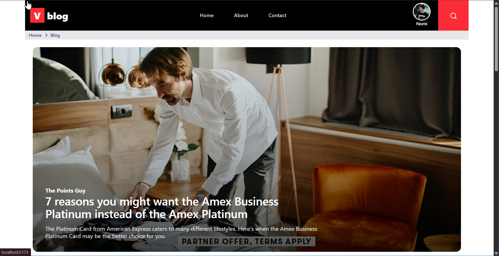
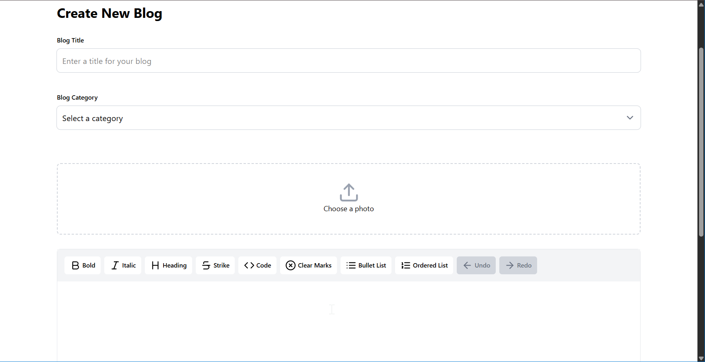
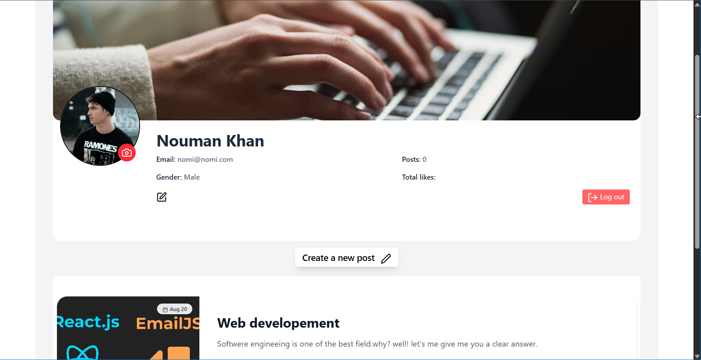
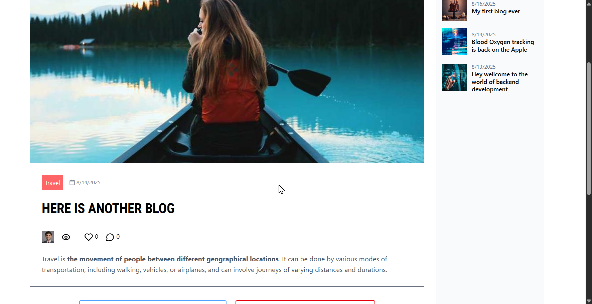

# Blog App 📝 (MERN + TypeScript)

A **full-featured blog application** built with the **MERN stack + TypeScript**.  
This project is part of my self-learning journey in web development (2+ years) while working a non-tech job.  
Users can create, update, delete, and read blogs; interact via likes and comments; and manage rich profiles.

---

## Table of Contents

- [Features](#features)
- [Architecture](#architecture)
- [Tech Stack](#tech-stack)
- [Packages](#packages)
  - [Frontend (client) Dependencies](#frontend-client-dependencies)
  - [Frontend DevDependencies](#frontend-devdependencies)
  - [Backend (server) Dependencies](#backend-server-dependencies)
  - [Backend DevDependencies](#backend-devdependencies)
- [Installation & Setup](#installation--setup)
  - [Prerequisites](#prerequisites)
  - [Clone](#1-clone)
  - [Backend Setup](#2-backend-setup)
  - [Frontend Setup](#3-frontend-setup)
  - [Run](#4-run)
- [Environment Variables](#environment-variables)
  - [Backend `.env`](#backend-env)
  - [Frontend `.env` (optional)](#frontend-env-optional)
- [Scripts](#scripts)
- [Project Structure](#project-structure)
- [API Overview (High Level)](#api-overview-high-level)
- [Screenshots / Demo](#screenshots--demo)
- [Roadmap / Future Improvements](#roadmap--future-improvements)
- [Contributing](#contributing)
- [Author](#author)

---

## Features

- 🔐 **Authentication** — Signup & Login with JWT; cookies for session handling.
- 📝 **Blogs** — Create, Read, Update, Delete blogs (CRUD).
- 🖼️ **Featured Images** — Upload featured images for posts (Cloudinary storage).
- ✍️ **Rich Editor** — Compose content with **TipTap** (bold, italic, lists, links, images, colors, etc.).
- 💬 **Interactions** — Like and comment on blogs.
- 👤 **Profiles**
  - Public profile pages: view other users and all their blogs.
  - Private profile management: update name, profile photo, etc.
  - Manage your own posts (edit/delete).
- ✂️ **Image Cropping** — Profile/blog image cropping via **react-image-crop**.
- 📰 **Hero Slider** — **Swiper** slider pulling **latest news/blogs from external APIs**; clicking a slide opens the original source site.
- 📱 **Responsive UI** — Styled with **Tailwind CSS**, smooth animations via **Framer Motion**.
- 🔔 **Toasts & UX** — Quick feedback with **react-hot-toast**.
- ✅ **Validation** — **Zod** on both client and server.
- 🗃️ **State** — Lightweight global state via **Zustand**.
- 🔗 **Routing** — Client routing via **React Router v7**.

---

## Architecture

- **Frontend:** React + TypeScript, Vite, TailwindCSS v4, React Router, Zustand, TipTap, Swiper.
- **Backend:** Express + TypeScript, MongoDB (Mongoose), JWT auth, Multer for uploads, Cloudinary for storage.
- **DB:** MongoDB (local or Atlas).
- **Build/Tooling:** Vite for client, `tsc` for server, ESLint for linting.

---

## Tech Stack

**Frontend**

- React 19 (TypeScript), Vite 6
- Tailwind CSS 4, Tailwind Merge, @tailwindcss/typography
- TipTap editor + extensions (color, image, link, text-style, starter-kit)
- React Router 7, Zustand, Zod
- Swiper (hero slider), React Hot Toast, Lucide icons
- Framer Motion (animations)
- EmailJS (optional contact/feedback flows)

**Backend**

- Node + Express (TypeScript)
- MongoDB + Mongoose
- JWT, Bcrypt, Cookie Parser, CORS
- Multer (uploads), Cloudinary (image storage)
- Zod (validation)
- ts-node-dev for dev workflow

---

## Packages

### Frontend (client) Dependencies

- `react@^19.0.0`
- `react-dom@^19.0.0`
- `react-router@^7.1.3`
- `tailwindcss@^4.0.0`
- `@tailwindcss/vite@^4.0.0`
- `@tailwindcss/typography@^0.5.16`
- `tailwind-merge@^3.0.1`
- `@tiptap/react@^2.11.5`
- `@tiptap/starter-kit@^2.11.5`
- `@tiptap/extension-color@^2.11.5`
- `@tiptap/extension-image@^2.11.5`
- `@tiptap/extension-link@^2.11.5`
- `@tiptap/extension-text-style@^2.11.5`
- `react-image-crop@^11.0.10`
- `swiper@^11.2.2`
- `framer-motion@^12.5.0`
- `lucide-react@^0.474.0`
- `react-hot-toast@^2.5.2`
- `zustand@^5.0.3`
- `zod@^3.24.2`
- `clsx@^2.1.1`
- `@emailjs/browser@^4.4.1`

### Frontend DevDependencies

- `vite@^6.0.5`
- `@vitejs/plugin-react@^1.3.2`
- `typescript@~5.6.2`
- `eslint@^9.17.0`
- `@eslint/js@^9.17.0`
- `typescript-eslint@^8.18.2`
- `eslint-plugin-react-hooks@^5.0.0`
- `eslint-plugin-react-refresh@^0.4.16`
- `globals@^15.14.0`
- `@types/react@^19.0.10`
- `@types/react-dom@^19.0.4`
- `sass-embedded@^1.85.1`

### Backend (server) Dependencies

- `express@^4.21.2`
- `mongoose@^8.9.4`
- `jsonwebtoken@^9.0.2`
- `bcrypt@^5.1.1`
- `cookie-parser@^1.4.7`
- `cors@^2.8.5`
- `dotenv@^16.4.7`
- `multer@^1.4.5-lts.2`
- `cloudinary@^2.6.0`
- `zod@^3.24.2`

### Backend DevDependencies

- `typescript@^5.7.3`
- `ts-node@^10.9.2`
- `ts-node-dev@^2.0.0`
- `@types/node@^22.10.5`
- `@types/express@^5.0.0`
- `@types/bcrypt@^5.0.2`
- `@types/cookie-parser@^1.4.8`
- `@types/cors@^2.8.17`
- `@types/jsonwebtoken@^9.0.7`
- `@types/multer@^1.4.12`

---

## Installation & Setup

### Prerequisites

- **Node.js** v18+
- **MongoDB** (local or Atlas)
- **Cloudinary** account (for image storage)

> Assumes a monorepo with `client/` and `server/` folders. Adjust paths if different.

### 1. Clone

```bash
git clone https://github.com/your-username/blog-app.git
cd blog-app
```

### 2. Backend Setup

```bash
cd server
npm install
```

Create `.env` inside `server/` (see [Environment Variables](#environment-variables)) and then:

```bash
npm run dev
```

### 3. Frontend Setup

```bash
cd ../client
npm install
npm run dev
```

### 4. Run

- Frontend (Vite): `http://localhost:5173`
- Backend (Express): `http://localhost:5000`

---

## Environment Variables

### Backend `.env`

```env
PORT=5000
MONGO_URI=your_mongodb_connection_string
JWT_SECRET=your_super_secret_jwt_key

# Cloudinary
CLOUDINARY_CLOUD_NAME=your_cloud_name
CLOUDINARY_API_KEY=your_api_key
CLOUDINARY_API_SECRET=your_api_secret
```

### Frontend `.env` (optional)

```env
# Point client to API
VITE_API_BASE_URL=http://localhost:5000

# If you use EmailJS on the client
VITE_EMAILJS_PUBLIC_KEY=your_emailjs_public_key
VITE_EMAILJS_SERVICE_ID=your_emailjs_service_id
VITE_EMAILJS_TEMPLATE_ID=your_emailjs_template_id
```

> The hero slider fetches **external news/blog APIs** for the home page. Add any necessary keys/endpoints and consume them in the client.

---

## Scripts

### Client (`client/package.json`)

- `dev` — Run Vite dev server
- `build` — Type-check + Vite build (`tsc -b && vite build`)
- `lint` — ESLint
- `preview` — Preview production build

### Server (`server/package.json`)

- `dev` — Start development server with `ts-node-dev` (`--respawn --transpile-only`)
- `build` — Compile TypeScript with `tsc`
- `start` — Run compiled server (`node dist/index.js`)

---

## API Overview (High Level)

> Endpoints may vary; this is a typical layout.

**Auth**

- `POST /api/auth/signup` — Create account
- `POST /api/auth/login` — Login & set auth cookie
- `POST /api/auth/logout` — Clear cookie

**Users**

- `GET /api/users/:id` — Public profile & posts
- `PATCH /api/users/me` — Update profile (name, photo, etc.) _(auth)_
- `GET /api/users/me` — Current user _(auth)_

**Posts**

- `GET /api/posts` — List posts (optionally by user, pagination)
- `POST /api/posts` — Create post _(auth)_
- `GET /api/posts/:id` — Get one
- `PATCH /api/posts/:id` — Update _(auth & owner)_
- `DELETE /api/posts/:id` — Delete _(auth & owner)_

**Interactions**

- `POST /api/posts/:id/like` — Toggle like _(auth)_
- `POST /api/posts/:id/comments` — Add comment _(auth)_
- `DELETE /api/posts/:id/comments/:commentId` — Delete own comment _(auth)_

**Uploads**

- `POST /api/uploads/image` — Upload image via Multer → Cloudinary _(auth)_

---

## Screenshots / Demo

> Replace placeholders with your images or a GIF demo.

| Home (Hero Slider)              | Editor (TipTap)                     |
| ------------------------------- | ----------------------------------- |
|  |  |

| Profile Page                          | Post Detail                     |
| ------------------------------------- | ------------------------------- |
|  |  |

---

## Roadmap / Future Improvements

- [ ] Dark mode 🌙
- [ ] Pagination & infinite scrolling for blogs
- [ ] User roles (Admin, Editor, User)
- [ ] Bookmarks / Save-for-later
- [ ] Notification center (likes, comments)
- [ ] Rich search & filters
- [ ] SEO meta tags & OpenGraph for posts
- [ ] Unit & integration tests (client/server)
- [ ] Deployment (Vercel frontend, Render/Fly/Heroku backend)

---

## Contributing

Contributions, issues, and feature requests are welcome!  
Feel free to open a PR or issue.

---

## Author

**Nouman Khan**

- GitHub: [@nouman4o4](https://github.com/nouman4o4)
- LinkedIn: [Nouman Khan](https://www.linkedin.com/in/nouman-khan-68372228b/)
